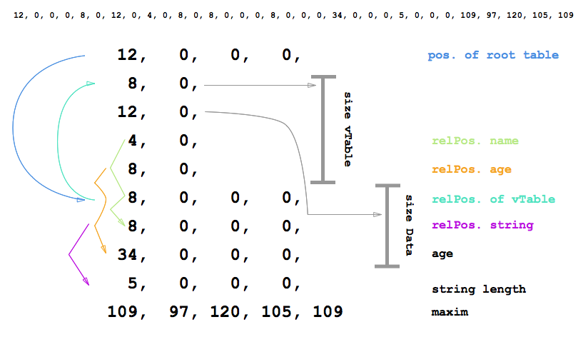

# flatbuffers binary explain note


## 1. simple example
example and picture from [here](https://github.com/mzaks/FlatBuffersSwift/wiki/FlatBuffers-Explained)

```
table Person {
  name: string;
  age : int;
}

root_type Person;
```


data as json object 

```
{"name":"maxim","age":34}
```


flatbuffers encoded binary



explain:

1. line 1:  header
2. line 2 to line 5 : root table ,  the "8" is  size of table in byte   / the "12" is size of object size in byte, notice: the data size include **line 6 to line 8** , total "12" byte , there line 7 is strings field is a vector 
3. line 6 , a SOffset , refers to vtable start 
4. line 7 is a vector field of strings, stored a SOffset that refers to start of  strings vector , strings stored in  line 9 / line 10   
5. line 8 a scalar field
6. line 9 / line 10 stored a strings vector
7. line 9 stored the real size of strings, the "maxim" is 5 byte
8. line 10 is strings "maxim". here is a mistake, a strings should be end with a "0" byte, and prefilled the end to 8 byte, so , it's shoud be [109, 97, 120, 105, 109, 0, 0 , 0 ]

## 2. another example ( vector )

```
table List {
  people : [Person];
}

table Person {
  firstName : string;
  lastName : string;
}

root_type List;
```

data as json object 

```
[{"firstName":"Maxim","lastName":"Zaks"},{"firstName":"Alex","lastName":"Zaks"}]
```


encoded binary explain 

```
10,   0,   0,   0,                   position of root table list : List
-- list : List
  6,   0,                             size vTable List  
  8,   0,                             size List data
  4,   0,                             rel. pos 'people' field
  -----------------
  6,   0,   0,   0,                   root of Table list : List
  4,   0,   0,   0,                   rel. pos people Vector
-- list.people
  2,   0,   0,   0,                   length of vector
  8,   0,   0,   0,                   rel. pos to p1 : Person
 33,   0,   0,   0,                   rel. pos to p2 : Person
-- p1                                 item 1 in array 
235, 255, 255, 255,                   root of Table p1 : Person  -- 20
  8,   0,   0,   0,                   rel. pos to String 'Maxim'
 41,   0,   0,   0,                   rel. pos to String 'Zaks'  
-- p1.firstName = "Maxim"
  5,   0,   0,   0,                    Length of 'Maxim' string
 77,  97, 120, 105, 109, 0, 0, 0       'Maxim' string UTF8 Encoded
-- p2                                  item 2 in array 
  8,   0,                             size vTable Person
 12,   0,                             size Person data
  4,   0,                             rel. pos 'firstName' field
  8,   0,                             rel. pos 'lastName' field
  -----------------
  8,   0,   0,   0,                   root of Table p2 : Person
  8,   0,   0,   0,                   rel pos. to String 'Alex'
 12,   0,   0,   0,                   rel pos. to String 'Zaks'
-- p2.firstName = "Alex"
  4,   0,   0,   0,                   length of String 'Alex'
 65, 108, 101, 120,                   'Alex' string UTF8 Encoded
-- p1.lastName = "Zaks" && p2.lastName = "Zaks"
  4,   0,   0,   0,                   length of String 'Zaks'
 90,  97, 107, 115,0,0,0,0                    'Zaks' string UTF8 Encoded
```


## 3. example in c++


data in json object 

```
{ pos: { x: 1, y: 2, z: 3 }, name: "fred", hp: 50 }
```


```
// Start of the buffer:
uint32_t 20  // Offset to the root table.

// Start of the vtable. Not shared in this example, but could be:
uint16_t 16 // Size of table, starting from here.
uint16_t 22 // Size of object inline data.
uint16_t 4, 0, 20, 16, 0, 0  // Offsets to fields from start of (root) table, 0 for not present.

// Start of the root table:
int32_t 16     // Offset to vtable used (default negative direction)
float 1, 2, 3  // the Vec3 struct, inline.
uint32_t 8     // Offset to the name string.
int16_t 50     // hp field.
int16_t 0      // Padding for alignment.

// Start of name string:
uint32_t 4  // Length of string.
int8_t 'f', 'r', 'e', 'd', 0, 0, 0, 0  // Text + 0 termination + padding.
```

